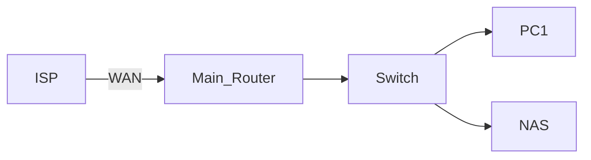

# 🖥️ Homelab Setup & Upgrade Documentation

This repository documents my homelab journey — from initial setup to upgrades, configuration changes, and experimental projects.  
It serves as both a personal log and a reference for others interested in building their own homelab.

---
## 📜 Table of Contents
- [Overview](#overview)
- [Current Setup](#current-setup)
- [Software](#software)
- [Network Diagram](#network-diagram)
- [Configuration Notes](#notes)
- [Upgrade Log](#upgrade-log)
- [Future Plans](#future-plans)
- [References](#references)

---

## 📌 Overview
> My homelab is a small-scale home server environment used for self-hosting services, learning networking concepts, experimenting with Linux, and running development projects.

---

## 🖧 Current Setup
| Device | Model / Specs | Purpose |
|--------|--------------|---------|
| Main Router | [PLDT/Converge ISP router] | Internet access from ISP |
| Ethernet Switch | [Mercusys/8 slots] | Connect multiple devices via LAN |
| PC1 | Forgot/8gb ddr4 /500gb HDD / 120gb SSD| Main daily driver / server experiments and monitoring |
| PC2 | Core i5 2ND GEN/8gb ddr3 /500gb HDD(low) | NAS server |

---

### 💽 Software

| Device | OS / Software | Purpose |
|--------|--------------|---------|
| PC1 | EndeavourOS | Main OS for monitoring |
| PC2 | Open Media Vault | NAS / Storage |

---

## 🗺 Network Diagram

---

## 📝 Notes
- **PC 1:** Runs **EndeavourOS** (Arch-based Linux).  
- **PC 2:** Runs **OpenMediaVault** (Debian-based NAS OS).  
- Current setup is simple — no dedicated firewall appliance or virtualization yet.  
- Upgrade path:  
  1. Add Archer router for basic network isolation.  
  2. Replace Archer with an **OPNsense** router running on dedicated hardware for advanced routing and security.
     
---

## 📈 Upgrade Log

| Date       | Upgrade / Change                           | Details                                                                 |
|------------|--------------------------------------------|-------------------------------------------------------------------------|
| 2025-08-12 | Initial documentation                      | Created README with current hardware, OS notes, and future plans.      |
| TBD        | Add Archer router for network isolation    | Place between ISP router and LAN switch to segment home network.       |
| TBD        | Deploy OPNsense on dedicated hardware      | Replace Archer with OPNsense box for advanced firewall & routing.      |
| TBD        | Expand NAS storage                         | Add additional HDDs or SSDs to OpenMediaVault for file storage & media.|

---
## 🔮 Future Plans
- Add storage to NAS for file storage.
- Archer (network Isolation) (Place-holder for OPNsense).
- OPNsense router 

---

## 📚 References

  
*Video: **Building A DIY NAS On A Budget - TrueNAS Scale** by [Hardware Haven](https://www.youtube.com/@HardwareHaven)*

- **OpenMediaVault User Guide** – [OMV Docs](https://openmediavault.readthedocs.io/)
- **EndeavourOS** – [EndeavourOS Home](https://endeavouros.com/)
